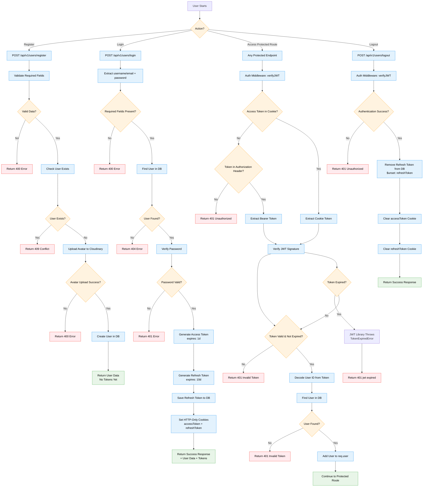
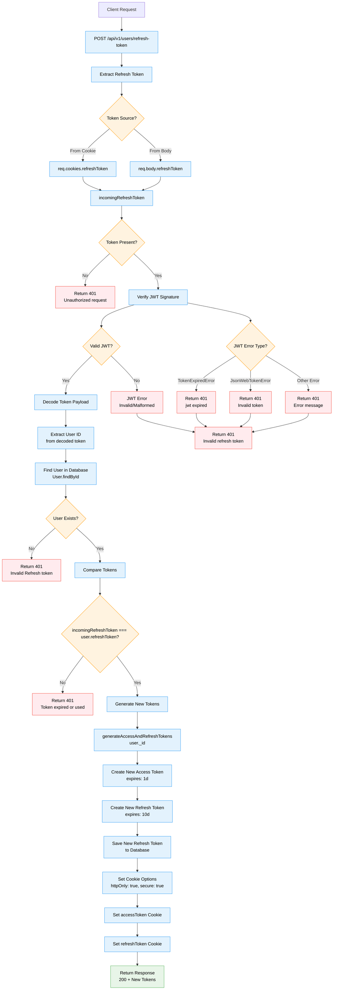
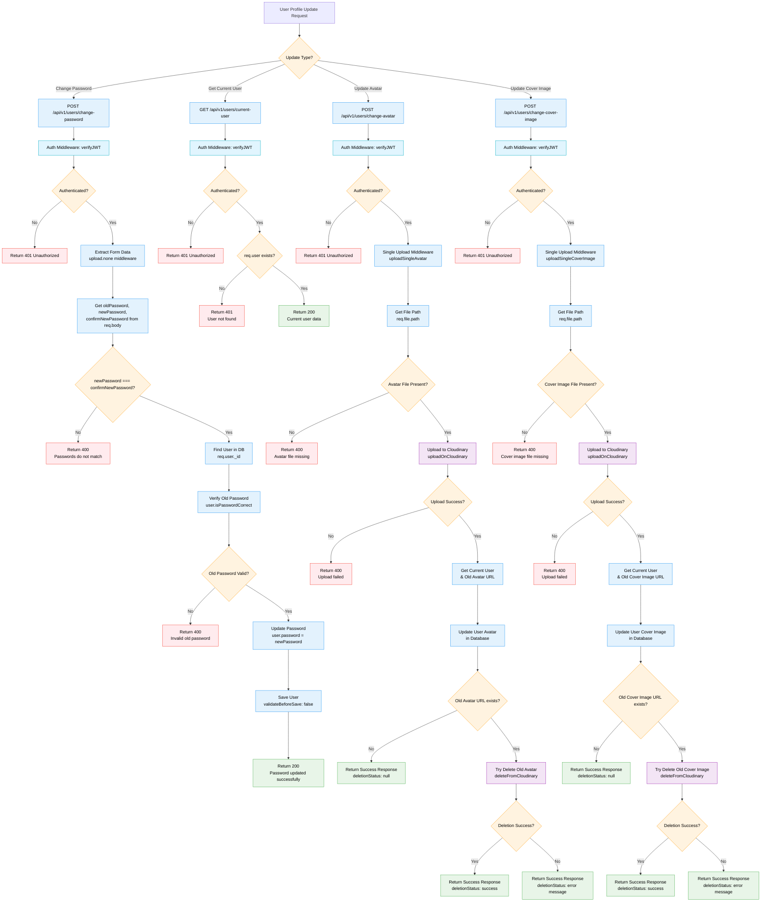
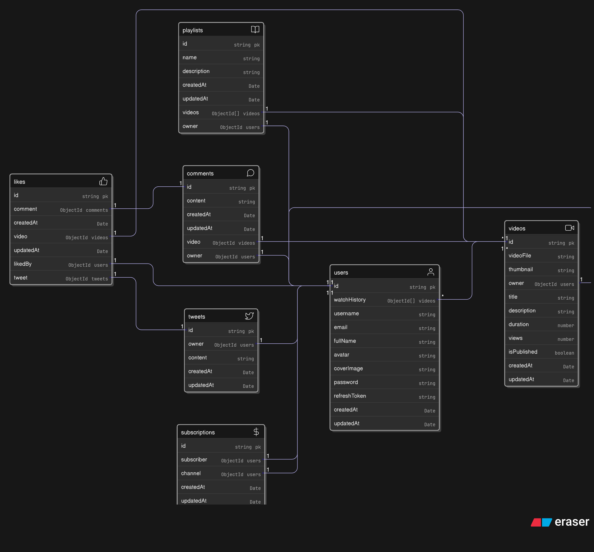

# BackTube - Backend for YouTube-inspired Platform

## Quick Start

### Prerequisites
- Node.js (v14 or higher)
- MongoDB Atlas account or local MongoDB installation
- Cloudinary account for image/video uploads

### Installation
```bash
# Clone the repository
git clone https://github.com/shoryasethia/backtube.git
cd backtube
```
# Install dependencies
```
npm install
```
### Environment Variables
Create a `.env` file in the root directory and add your environment variables. 

You can use the `.env.example` file as a template:
```bash
cp .env.example .env
```

Then update the values in `.env` with your actual credentials:
- MongoDB connection string
- JWT secrets (generate secure random strings)
- Cloudinary credentials for image/video uploads

### Starting the Development Server
```bash
# Start development server with auto-reload
npm run dev

# Or start production server
npm start
```

The server will start on `http://localhost:8000`

## Flow Diagrams

<details>
<summary>Authentication</summary>



</details>

<details>
<summary>Refresh Access Token</summary>



</details>

<details>
<summary>User Profile Updates</summary>



</details>

## Database Schema / Data Model

<details>
<summary>Database Schema Diagram</summary>



</details>

## API Testing

### Postman Collection
You can test the API endpoints using our Postman collection:

**[BackTube API Collection](https://shoryasethia.postman.co/workspace/Shorya-Sethia's-Workspace~2988e049-8a94-4224-8f3b-baf9295c8093/collection/45179578-ef61529f-1127-4054-95bd-6102984a03d8?action=share&creator=45179578&active-environment=45179578-1756074b-0697-45b4-acd1-03fd72d67ace)**

#### Environment Setup
The collection uses an environment variable:
- **Variable Name**: `server`
- **Value**: `http://localhost:8000/api/v1`

Make sure to set this environment variable in your Postman environment before testing the endpoints.


### Available Endpoints

#### User Management
- `POST /api/v1/users/register` - Register a new user with avatar and optional cover image
- `POST /api/v1/users/login` - User login with username/email and password
- `POST /api/v1/users/logout` - User logout (requires authentication)
- `POST /api/v1/users/refresh-token` - Refresh access token using refresh token
- `GET /api/v1/users/current-user` - Get current authenticated user data (requires authentication)
- `POST /api/v1/users/change-password` - Change user password (requires authentication)
- `POST /api/v1/users/change-avatar` - Update user avatar image (requires authentication)
- `POST /api/v1/users/change-cover-image` - Update user cover image (requires authentication)
- `GET /api/v1/users/channel/:username` - Get user channel profile with subscriber count and subscription status
